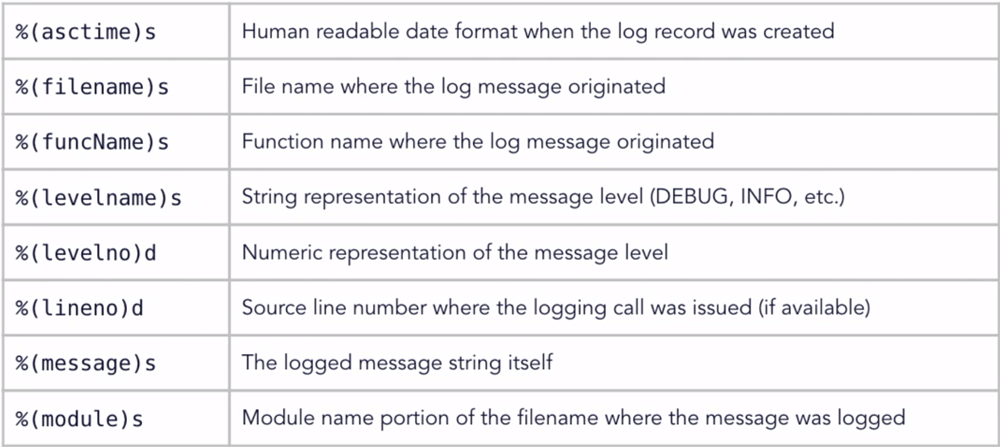

## Advenced Python Course Documentation
### Built-In Functions
#### Iterators
```python
days = ["Sun", "Mon", "Tue", "Wed", "Thu" "Fri", "Sat"]
numbers = [1, 2, 3, 4, 5, 6, 7]

# Use iter to create an iterator over a collection
i = iter(days)
print(next(i))  #Sun
print(next(i))  #Mon
print(next(i))  #Tue

# Iterate using a function and a sentinel
with open("test.txt", "r") as fp:
    for line in iter(fp.readline, ''):
        print(line)

# Use regular interation over the days
for i in range(len(days)):
    print(i+1, days[i])

# Using enumerate reduces code
for i, d in enumerate(days, start=1):
    print(i, d)

# Using zip to combain sequences (results tuple)
for i in zip(days, numbers):
    print(i)  # ('Sun', 1)
              # ('Mon', 2)
              # ...
```
 

 #### Transforms
 ```python
 nums = (1, 8, 4, 5, 13, 26, 381, 410, 47)
 chars = "abcDeFGHiJklmnoP"
 grades = (81, 89, 94, 78, 61, 66, 99, 74)

 # Use filter to remove items from a list
 def filterFunc(x):
    if x % 2 == 0:
        return False
    return True

odds = list(filter(filterFunc, nums))

# Use filter on non-numeric sequence
def filterFunc2(c):
    if not c.islower():
        return False
    return True

lowers = list(filter(filterFunc2, chars))

# Use map to create a new sequence of values
def squareFunc(x):
    return x**2
    
squares = list(map(squareFunc, nums))

# Use sorted and map to change numbers to grades
def toGrade(x):
    if x >= 90:
        return "A"
    elif x >= 80:
        return "B"
    elif x >= 70:
        return "C"
    elif x >= 65:
        return "D"
    else:
        return "F"

grades = sorted(grades)
letters = list(map(toGrade, grades))
for g in zip(grades, letters):
    print(g)  # (grade, letter) e.g. (99, 'A')
 ```


 #### Itertools
 ```python
 import itertools

 # cycle iterator - cycle over a collection
 seq1 = ["Joe", "Bob", "Alice"]
 cycle1 = itertools.cycle(seq1)
 print(next(cycle1))  # Joe
 print(next(cycle1))  # Bob
 print(next(cycle1))  # Alice
 print(next(cycle1))  # Joe

# count - to create a simple counter
count1 = itertools.count(100, 10)  # (<start>, <jump>)
print(next(count1))  # 100
print(next(count1))  # 110
print(next(count1))  # 120

# accumulate - iterator that accumulates values
vals = [10, 20, 30, 40, 50, 40, 30]
acc = itertools.accumulate(vals)
print(list(acc))  # [10, 30, 60, 100, 150, 190, 220]
acc = itertools.accumulate(vals, max)
print(list(acc))  # [10, 20, 30, 40, 50, 50, 50]

# chain - to connect sequences together 
x = itertools.chain("ABCD", "1234")
print(list(x))  # ['A', 'B', 'C', 'D', '1', '2', '3', '4']

# dropwhile and takewhile - return values until the condition stops them
def testFunc(x):
    return x < 40

vals = [10, 20, 30, 40, 50, 40, 30]
print(list(itertools.dropwhile(testFunc, vals)))  # [40, 50, 40, 30]
print(list(itertools.takewhile(testFunc, vals)))  # [10, 20, 30]
 ```
&nbsp;
___
### Advenced Python functions
#### Documentation strings
```python
print(map.__doc__)  # map function doc
```
```python
import collections
print(collections.__doc__)  # collections doc
```
```python
def myFunc(arg1, arg2=None):
    """
    myfunc --> Just print.

    Parameters:
    arg1: first argument.
    arg2: second argument. Defaults to None.
    """

print(myFunc.__doc__)  # Will print the doc that we wrote
```


#### Variable argument lists
```python
def addition(*args):
    result = 0
    for arg in args:
        result += arg
    return result

lst1 = [5, 10, 15]
print(addition(5, 10, 15))  # Will print 30
print(addition(*lst1))  # Will print 30    
```

#### Lambda Functions
- Small, anonymous functions.
- Can be passed as arguments where you need a function.
- Typically used in place just when needed.
- Defined as:
```python
lambda(parameters):(expression)
```
```python
# Use map & function
def squareFunc(x):
    return x**2
    
nums = [2, 4, 6]
print(list(map(squareFunc, nums)))  # will print [4, 16, 36]

# Use map & lambda
nums = [2, 4, 6]
print(list(map(lambda x: x**2, nums)))  # will print [4, 16, 36]
```

#### Using Keyword-Only Arguments
```python
def myFunc(arg1, arg2, *, arg3="foo"):
    pass

myFunc(1, 2, arg3="bar")
```
&nbsp;
___
### Advanced Collections 
#### Basic Collections
- *list*
- *tuple*
- *set*
- *dictionary*
#### Advanced Collections
```python
import collections
```
- *namedtuple* - Tuple with named fields
- *OrderedDict, defaultdict* - Dictionaries with special properties
- *Counter* - Counts distinct values
- *deque* - Double-ended list object


#### Using namedtuple
```python
# regular tuple - become hard to read in complex code
p = (10, 20)
p[0]  # 10
p[1]  # 20


# namedtuple
import collections

Point = collections.namedtuple("Point", "x y")
p1 = Point(10, 20)
p2 = Point(30, 40)

print(p1, p2)  # Point(x=10, y=20) Point(x=30, y=40)
print(p1.x, p2.y)  # 10 40

p1 = p1.__replace(x=100)  # use __replace to create new instance
print(p1)  # Point(x=100, y=20)
```

#### Using defaultdict
```python
fruits = ['apple', 'pear', 'orange', 'banana',
'apple', 'grape', 'banana', 'banana']


# use a dictionary to count each elemnt - we will get an ERROR!!!
fruitCounter = {}

for fruit in fruits:
    fruitCounter[fruit] += 1  # need to initialize first

for (k, v) in fruitCounter.items():
    print(k + ": " + str(v))


# add a condition to fix the ERROR - less readable
for fruit in fruits:
    if fruit in fruitCounter.keys():
        fruitCounter[fruit] += 1
    else:
        fruitCounter[fruit] = 1


# use a defaultdict
from collections import defaultdict

fruitCounter = defaultdict(int)

for fruit in fruits:
    fruitCounter[fruit] += 1

for (k, v) in fruitCounter.items():
    print(k + ": " + str(v))
```
```python
# can create your own default using lambda
dict1 = defaultdict(lambda: 100)
```

#### Using Counters
```python
from collections import Counter
class1 = ["Bob", "Becky", "Chad", "Frnak", "Kevine", "James", "James"]
class1 = ["Bill", "Barry", "Tara", "Abigail"]

c1 = Counter(class1)  # c1 = {"Bob": 1, "Becky": 1, ...}
c2 = Counter(class2)

# How many students named James:
print(c1["James"])

# How many students are in class 1:
print(sum(c1.values()))

# combain the 2 classes:
c1.update(class2)  # add class 2 data into c1

# most 3 common in c1:
print(c1.most_common(3))

# subtract class from c1:
c1.subtract(class2)

# what's common between the 2 classes:
print(c1 & c2)
```


#### Using deque
```python
# initialize a deque with lowercase letters
d = collections.deque(string.ascii_lowercase)

# support len()
print("Item count: ", str(len(d)))

# can be iterated over
for elem in d:
    print(elem.upper())

# mainpulate items
d.pop()
d.popleft()
d.apppend(2)
d.appendleft(1)
    
# rotate
d.rotate(10)  # rotate 10 steps
```
&nbsp;
___
### Advanced Classes and Objects

#### Defining enumerations
```python
from enum import Enum

class Fruit(Enum):
    APPLE = 1
    BANANA = 2
    ORANGE = 3
    TOMATO = 4

print(Fruit.APPLE)  # Fruit.APPLE
print(type(Fruit.APPLE))  # <enum 'Fruit'>
print(repr(Fruit.APPLE))  # <Fruit.APPLE: 1>
print(Fruit.APPLE.name)  # APPLE (name must be unique)
print(Fruit.APPLE.value)  # 1 (not have to be unique)


# unique enum - values must be unique also
from enum import Enum, unique

@unique
class Fruit(Enum):
    APPLE = 1
    BANANA = 2
    ORANGE = 3
    TOMATO = 1  # will cause an ERROR!


# enum with auto
from enum import Enum, auto

@unique
class Fruit(Enum):
    APPLE = 1
    BANANA = 2
    ORANGE = auto()  # ORANGE = 3
```
&nbsp;
#### Class String Functions
| String Function | Called When |
|----------|----------|
| ```object.__str__(self)``` | str(object), print(object), "{0}".format(object) |
| ```object.__repr__(self)``` | repr(object) |
| ```object.__format__(self, format_spec)``` | format(object, format_spec) |
| ```object.__bytes__(self)``` | bytes(object) |
&nbsp;
```python
class Person():
    def __init__(self):
        self.fname = "Avigail"
        self.lname = "Hagay"
        self.age = 26

# In all of this options we will see a string that 
# repersents the class name and its adress in memory
cls1 = Person()
print(repr(cls1))  
print(str(cls1))
print("Formatted: {0}".format(cls1))  # acts like print(str(cls1))

# overwrite __repr__ to create a string - useful for debugging
def __repr__(self):
    return "<Person Class - fname:{0}, lname:{1}, age:{2}".format(self.fname, self.lname, self.age)

# overwrite __str__ to create a string
def __str__(self):
    return "<Person ({0} {1} is {2})".format(self.fname, self.lname, self.age)
```
&nbsp;
#### Computed Attribute
| Attribute | Called When |
|----------|----------|
| ```object.__getattribute__(self, attr)``` | object.attr |
| ```object.__getattr__(self, attr)``` | object.attr |
| ```object.__setattr__(self, attr, val)``` | object.attr = val |
| ```object.__delattr__(self)``` | del object.attr |
| ```object.__dir__(self)``` | dir(object) |
&nbsp;
```python
class myColor():
    def __init__(self):
        self.red = 50
        self.green = 75
        self.blue = 100
    
    # use getatter to dynamically return a value
    def __getattr__(self, attr):
        if attr == "rgbcolor":
            return (self.red, self.green, self.blue)
        else:
            raise AttributeError

    # use setatter to dynamically return a value
    def __setattr__(self, attr, val):
        if attr == "rgbcolor":
             self.red = val[0]
             self.green = val[1]
             self.blue = val[2]
        else:
            super().__setattr__(attr, val)  # because in first init self.red = 50... will call the setatter

    # use dir to list the available properties
    def __dir__(self):
        return("red", "green", "blue", "rgbcolor")

cls1 = myColor()
print(cls1.rgbcolor)  # (50, 75, 100)
print(cls1.dsjfkdslf)  # AttributeError

cls1.rgbcolor = (125, 200, 86)
print(cls1.rgbcolor)  # (125, 200, 86)

print(dir(cls1))  # ["red", "green", "blue", "rgbcolor"]
```
&nbsp;
#### Object operations
| Numeric function | Called When |
|----------|----------|
| ```object.__add__(self, other)``` | self + other |
| ```object.__sub__(self, other)``` | self - other |
| ```object.__mul__(self, other)``` | self * other |
| ```object.__div__(self, other)``` | self / other |
| ```object.__floordiv__(self, other)``` | self // other |
| ```object.__pow__(self, other)``` | self ** other |
| ```object.__and__(self, other)``` | self & other |
| ```object.__or__(self, other)``` | self | other |
| ```object.__iadd__(self, other)``` | self += other |
| ```object.__isub__(self, other)``` | self -= other |
| ```object.__imul__(self, other)``` | self *= other |
| ```object.__itruediv__(self, other)``` | self /= other |
| ```object.__ifloordiv__(self, other)``` | self //= other |
| ```object.__ipow__(self, other)``` | self **= other |
| ```object.__iand__(self, other)``` | self &= other |
| ```object.__ior__(self, other)``` | self |= other |
&nbsp;
```python
class Point():
    def __init__(self, x, y):
        self.x = x
        self.y = y
    
    def __repr__(self):  # __str__ will act the same
        return "<Point x:{0}, y:{1}>".format(self.x, self.y)
    
    # return new Point
    def __add__(self, other):
        return Point(self.x + other.x, self.y + other.y)

    # return new Point
    def __sub__(self, other):
        return Point(self.x - other.x, self.y - other.y)

    # return the self point
    def __iadd__(self, other):
        self.x += other.x
        self.y += other.y
        return self


p1 = Point(5, 10)
p2 = Point(2, 4)

p3 = p1 + p2  
print(p3)  # <Point x:7, y:14>

p4 = p1 - p2  
print(p4)  # <Point x:3, y:6>
```
&nbsp;
#### Object comparisons
| Comparisons function | Called When |
|----------|----------|
| ```object.__gt__(self, other)``` | self > other |
| ```object.__ge__(self, other)``` | self >= other |
| ```object.__lt__(self, other)``` | self < other |
| ```object.__le__(self, other)``` | self <= other |
| ```object.__eq__(self, other)``` | self == other |
| ```object.__ne__(self, other)``` | self != other |

&nbsp;
___
### Using Logging
#### Logging Levels
| Message Level | Logging API | Description |
|----------|----------|----------|
| ```DEBUG``` | ```logging.debug()``` | Diagnosic information useful for debugging |
| ```INFO``` | ```logging.info()``` | General information about program execution results |
| ```WARNING``` | ```logging.warning()``` | Something unexpected, or an approaching problem |
| ```ERROR``` | ```logging.error()``` | Unable to perform a specific operation due to problem |
| ```CRITICAL``` | ```logging.critical()``` | Program may not be able to continue, serious error |

&nbsp;
*Basic logging*
```python
import logging

# not displayed - By default level is set to warning:
logging.debug("This is a debug message")
logging.info("This is an info message")
# displayed:
logging.warning("This is a warning message")
logging.error("This is an error message")
logging.critical("This is a critical message")

# To display also the debug and the info logging
logging.basicConfig(level=logging.DEBUG)

# To display the log content into a file - append
logging.basicConfig(filename="output.log")

# To display the log content into a file - old contect will be replaced
logging.basicConfig(filename="output.log", filemode="w")
```

*custom logging*

```python
import logging

# add your format
fmtstr = "%(asctime)s: %(levelname)s: %(funcName)s: Line:%(lineno)d %(message)s."
logging.basicConfig(format=fmtstr)

logging.critical("This is a critical message")
# 2023-11-23 20:12:00,534: CRITICAL: main: Line:7 This is a critical message.
```

&nbsp;
___
### Python Comprehensions
```python
# with no comprehensions:
print(list(map(squareFunc, [2, 4, 6])))  # [4, 16, 36]

# with comprehensions - more simple:
print([ x ** 2 for x in [2, 4, 6] ])  # [4, 16, 36]
```
